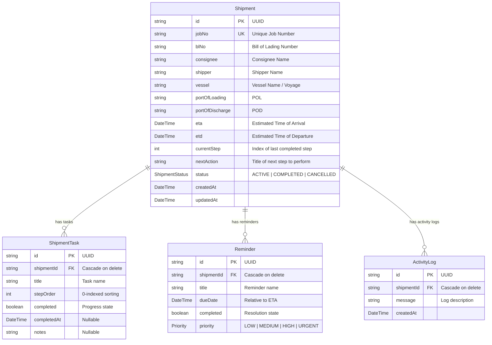

# CS Eksim Tracker - System Documentation

Welcome to the **CS Eksim Tracker (Import Export Customer Service Tracking Suite)**. This system is designed as an internal freight operations workflow tool to monitor shipments, track checklist tasks, and manage operations reminders/exceptions in real time.

---

## 1. Feature Architecture & Functional Details

### 1.1. Command Dashboard (`/`)
The primary operational cockpit for Customer Service personnel. It highlights current workloads and alerts users to critical time-sensitive events.

#### A. KPI Metrics Row
Four real-time metric cards that summarize current pipeline health:
*   **Total Active**: Displays the total count of active shipments (`status: ACTIVE`) currently in progress.
*   **Need Action Today**: Count of incomplete reminders where the due date is today.
*   **Overdue Reminders**: Count of incomplete reminders where the due date is prior to today. This indicates tasks that have missed their target operational window.
*   **ETA This Week**: Count of active shipments arriving between today and the end of the current week.

#### B. Exception & Action Board
An action-oriented board split into three columns:
*   **Overdue Action Queue**: Displays incomplete reminders whose target dates are in the past. Cards in this column are highlighted with urgency indicators to signal that operations are falling behind SLA.
*   **Today's Action Board**: Displays reminders due today, sorted by priority (`URGENT` > `HIGH` > `MEDIUM` > `LOW`).
*   **Upcoming Actions Pipeline**: Lists the next 15 upcoming incomplete reminders due after today, helping CS plan ahead.

#### C. Quick-Action Resolve on Reminder Cards
Each reminder card on the dashboard now contains an inline action row at the bottom with two controls:
*   **"Resolve" Button** (`ResolveReminderButton`): A one-click button that immediately marks the reminder as `completed = true` via a Server Action. While the action is in-flight, the button shows a spinner and is disabled to prevent double-submission. On success, both the dashboard (`/`) and the related shipment detail page (`/shipments/[id]`) are revalidated automatically.
*   **"View Detail" Link**: A secondary link that navigates CS directly to the full `/shipments/[id]` page for deeper inspection without leaving the dashboard.

---

### 1.2. Shipments File Ledger (`/shipments`)
A comprehensive, searchable repository of all historical and active shipments.
*   **Global Search**: Allows users to filter shipments instantly by **Job Number**, **B/L or AWB Number**, **Consignee Corporate Name**, or **Shipper Corporate Name**.
*   **Status Filter**: Filter by `ACTIVE`, `COMPLETED`, or `CANCELLED`.
*   **Sorting**: Sort shipments chronologically by **ETA** (Ascending or Descending).
*   **Pagination**: Handled on the server side to support thousands of shipments efficiently.

---

### 1.3. Pipeline Provisioning (`/shipments/create`)
The entrance point for new operational tasks. When CS initializes a new tracking pipeline, the system automates task creation:
*   **Inputs**: Job Number, Bill of Lading (B/L) / AWB, Shipper, Consignee, Vessel Reference, Port of Loading (POL), Port of Discharge (POD), ETD, and ETA.
*   **Validation**: Uses a Zod schema (`shipmentSchema`) to enforce constraints (e.g., minimum text lengths, valid date structures, and a constraint preventing **ETA** from being earlier than **ETD**).
*   **Task Auto-Generation**: Generates 18 sequential steps (defined in `WORKFLOW_STEPS`) in the `ShipmentTask` table.
*   **Reminder Auto-Generation**: Generates 5 default reminders calculated relative to the shipment's **ETA** (defined in `REMINDER_TEMPLATES`).

---

### 1.4. File Inspection / Shipment Details (`/shipments/[id]`)
An interactive checklist dashboard for checking progress and marking tasks completed.
*   **ShipmentInfoCard**: A read-only card showing core logistics, ports, and vessel dates.
*   **ProgressCard**: A visual tracker displaying percentage completion, current step number, and the immediate next action.
*   **WorkflowChecklist**: An interactive list of all 18 sequential tasks.
    *   CS can toggle tasks as complete.
    *   Toggling a task automatically records a timestamp (`completedAt`) and supports entering inline notes (e.g., billing references, customs numbers).
    *   Completing the final task ("Delivered") automatically archives the shipment, updating its status to `COMPLETED` and setting its next action to `"Archive Complete"`.

---

## 2. Database Models (`prisma/schema.prisma`)

The database uses PostgreSQL (configured via Prisma). It contains three main entities:



---

## 3. Project File Structure & Layering

The codebase is organized following clean architectural practices:

*   `app/`: Next.js routing, layouts, and page entrypoints.
*   `actions/`: Next.js Server Actions used to bridge client triggers and database mutations.
*   `components/`: Reusable global UI elements (sidebar, layout, etc.).
*   `features/`: Module-specific code grouped by business domains:
    *   `dashboard/`: Widgets, action queues, and metrics cards.
    *   `shipments/`: Shipment forms, lists, info blocks, and the interactive workflow checklist.
*   `repositories/`: Database query logic (encapsulating Prisma queries).
    *   `shipment-repository.ts`: Direct CRUD actions for shipments, tasks, and reminders.
*   `service/`: Business services coordinates workflows.
    *   `dashboard-service.ts`: Resolves metric counts and action board datasets.
    *   `shipment-service.ts`: Handles automated task calculation, relative reminder scheduling, and sequential step transitions.
*   `lib/`: Validator schemas, shared types, and static configuration/constants.

---

## 4. Extension & Future Customization Guide

### 4.1. Modifying the Checklist Workflow Steps
If your team wants to add, remove, or change operational steps (e.g., adding a step for "Container Returned" after "Delivered"):
1.  Open [lib/workflow.ts](file:///d:/Project/Nextjs/shipment-track/lib/workflow.ts).
2.  Update the array `WORKFLOW_STEPS`:
    ```typescript
    export const WORKFLOW_STEPS = [
      "Shipment Received",
      // ... existing steps
      "Delivered",
      "Empty Container Returned", // <--- Add your new step here
    ] as const;
    ```
3.  The system will automatically generate this new task in the correct order for all **new** shipments.

### 4.2. Customizing Automated Reminder Templates
To adjust default reminders (e.g., adding an alert for "Booking Trucking" 4 days before ETA):
1.  Open [lib/workflow.ts](file:///d:/Project/Nextjs/shipment-track/lib/workflow.ts).
2.  Add a new rule to the `REMINDER_TEMPLATES` array:
    ```typescript
    export const REMINDER_TEMPLATES = [
      { daysBeforeEta: 7, title: "Check Draft PIB", priority: "MEDIUM" as const },
      { daysBeforeEta: 4, title: "Pre-book Trucking Co.", priority: "HIGH" as const }, // <--- Added
      // ... other templates
    ];
    ```
3.  The `ShipmentService` automatically processes this array to schedule reminders relative to the ETA when creating a shipment.

### 4.3. Updating Database Schema
To add new fields (e.g., `containerNo` or `consigneeEmail`) to shipments:
1.  Open [prisma/schema.prisma](file:///d:/Project/Nextjs/shipment-track/prisma/schema.prisma) and add the field:
    ```prisma
    model Shipment {
      // ... existing fields
      containerNo String? // <--- Add new fields here
    }
    ```
2.  Run the migration command in terminal:
    ```bash
    pnpm prisma migrate dev --name add-container-no
    ```
3.  Update the validator schema in [lib/validator.ts](file:///d:/Project/Nextjs/shipment-track/lib/validator.ts) to handle input fields inside the creation form.

---

## 5. Changelog

### v1.1.0 — 2026-06-21: Quick-Action Resolve on Dashboard Reminder Cards

**Feature**: Added a "Resolve" quick-action button directly on each reminder card in the Exception & Action Board on the main dashboard.

#### Problem
Previously, CS staff had to navigate from the dashboard into the full shipment detail page (`/shipments/[id]`) just to mark a reminder as resolved. This added unnecessary navigation friction for a simple one-click operation.

#### Solution
Added an inline action row at the bottom of every `ReminderCard` on the dashboard containing:
1.  A **"Resolve" button** that calls the existing `toggleReminderAction` Server Action with a `completed: true` payload.
2.  A **"View Detail" link** for quick navigation to the shipment detail page when deeper context is needed.

#### Files Changed

| File | Change |
|------|--------|
| [`features/dashboard/ResolveReminderButton.tsx`](file:///d:/Project/Nextjs/shipment-track/features/dashboard/ResolveReminderButton.tsx) | **[NEW]** Client component with `useTransition` for pending state UX (spinner + disabled state while Server Action is in flight). |
| [`features/dashboard/ReminderCard.tsx`](file:///d:/Project/Nextjs/shipment-track/features/dashboard/ReminderCard.tsx) | **[MODIFIED]** Removed `"use server"` directive and old `<form>` toggle pattern. Restructured layout to include the new action row. Added `View Detail` link via `next/link`. |

#### Architecture Notes
*   `ResolveReminderButton` is a `"use client"` component intentionally separated from `ReminderCard` so that `ReminderCard` itself remains a lightweight server-renderable component (no `"use client"` directive needed on the card itself).
*   The `toggleReminderAction` Server Action already handles `revalidatePath("/")` and `revalidatePath("/shipments/[id]")`, so no additional cache invalidation was needed.
*   The `shipmentId` is passed through from `item.shipment.id` to allow per-shipment path revalidation.

### v1.2.0 — 2026-06-21: Multi-column Sort & Global Progress Loading Integration

**Feature**: Added secondary sorting configuration to the Shipment File Ledger, and implemented a global progress loading indicator for page navigations and Server Action transitions.

#### 1. Multi-column Sort (Status + ETA)
*   **Problem**: Shipments list was sorted only by ETA, resulting in active shipments being mixed with completed or cancelled ones.
*   **Solution**: Modified `ShipmentRepository.findAll` to implement multi-column sorting: sorting by `status` alphabetically first (`ACTIVE` → `CANCELLED` → `COMPLETED` matching our operational preference), followed by `eta` as a secondary sorting criterion.
*   **Shadcn Compliance**: Updated status badges color styling to use semantically compliant Shadcn class styles.

#### 2. Progress Loading Indicator (BProgress)
*   **Problem**: No visual feedback was shown when transitioning between routes or waiting for asynchronous database writes (Server Actions) to complete.
*   **Solution**: Integrated `@bprogress/next` (modern TypeScript replacement for NProgress).
    *   Configured the global provider in [`components/layout/Providers.tsx`](file:///d:/Project/Nextjs/shipment-track/components/layout/Providers.tsx) to use the Shadcn CSS token `var(--primary)` and a thin layout size (`3px`), ensuring color coordination with the active theme (including dark and light modes).
    *   Hooked manual controls (`useProgress` API) into components executing Server Actions (creating a shipment, toggling task checklist status, updating task notes, resolving dashboard reminders) using React's transition states.

#### Files Changed

| File | Change |
|------|--------|
| [`repositories/shipment-repository.ts`](file:///d:/Project/Nextjs/shipment-track/repositories/shipment-repository.ts) | **[MODIFIED]** Updated `findAll` sorting logic using multi-column `orderBy` array. |
| [`features/shipments/ShipmentTable.tsx`](file:///d:/Project/Nextjs/shipment-track/features/shipments/ShipmentTable.tsx) | **[MODIFIED]** Replaced custom tailwind/emerald badge styles with Shadcn compliant tokens. |
| [`components/layout/Providers.tsx`](file:///d:/Project/Nextjs/shipment-track/components/layout/Providers.tsx) | **[MODIFIED]** Refactored progress loading to target `var(--primary)` color token instead of static color. |
| [`features/dashboard/ResolveReminderButton.tsx`](file:///d:/Project/Nextjs/shipment-track/features/dashboard/ResolveReminderButton.tsx) | **[MODIFIED]** Injected `useProgress` manual triggers within transition handlers. |
| [`features/shipments/WorkFlowChecklist.tsx`](file:///d:/Project/Nextjs/shipment-track/features/shipments/WorkFlowChecklist.tsx) | **[MODIFIED]** Integrated progress hooks for task status toggles and note submission events. |
| [`features/shipments/ShipmentForm.tsx`](file:///d:/Project/Nextjs/shipment-track/features/shipments/ShipmentForm.tsx) | **[MODIFIED]** Hooked progress triggers during tracker pipeline provisioning. |

### v1.2.1 — 2026-06-21: Bidirectional Synchronization Between Reminders and Workflow Tasks

**Feature**: Connected reminders on the dashboard with tasks in the shipment workflow.

#### Problem
Previously, marking a reminder as "Resolved" on the dashboard only updated the `Reminder` record itself, leaving the corresponding operational shipment workflow task incomplete and the overall shipment progress percentage unchanged.

#### Solution
Implemented bidirectional mapping and automatic synchronization between reminders and workflow tasks:
1.  **Reminder to Task Sync**: Resolving a reminder (e.g. clicking "Resolve" on the dashboard) automatically resolves the matching workflow task and recalculates the shipment's current step, next action, and status (including logging to Activity Logs).
2.  **Task to Reminder Sync**: Toggling a task's status on the shipment checklist page automatically updates the completion status of the corresponding reminder, removing it from the dashboard's active exception queues.

#### Mapping Logic
*   `Check Draft PIB` (Reminder) ↔ `Draft PIB` (Task)
*   `Monitor BC 1.1` (Reminder) ↔ `BC 1.1 Available` (Task)
*   `Request Invoice DO` (Reminder) ↔ `Request Invoice DO` (Task)
*   `Payment Finance` (Reminder) ↔ `Payment Finance` (Task)
*   `Confirm Draft PIB` (Reminder) ↔ `Confirm Draft PIB` (Task)

#### Files Changed

| File | Change |
|------|--------|
| [`repositories/shipment-repository.ts`](file:///d:/Project/Nextjs/shipment-track/repositories/shipment-repository.ts) | **[MODIFIED]** Added `findReminderById`, `findReminderByTitle`, and `findTaskByTitle` query helpers. |
| [`service/shipment-service.ts`](file:///d:/Project/Nextjs/shipment-track/service/shipment-service.ts) | **[MODIFIED]** Added bidirectional synchronization logic inside `toggleTaskProgress` and implemented `toggleReminderProgress`. |
| [`actions/shipment-action.ts`](file:///d:/Project/Nextjs/shipment-track/actions/shipment-action.ts) | **[MODIFIED]** Updated `toggleReminderAction` server action to route through the service's sync method (`toggleReminderProgress`). |

### v1.3.0 — 2026-06-21: Debounced Client-Side Search for Shipment File Ledger

**Feature**: Implemented real-time debounced search on the shipments page, removing the need for manual form submission (pressing Enter).

#### Problem
CS staff had to type their search term and press Enter to trigger the search form, causing full page reloads and providing no visual progress indicators while results were loading.

#### Solution
Replaced the traditional HTML form search with a customized client-side **`ShipmentSearch`** component:
1.  **State Debounce**: Holds local state and triggers route replacement only after `400ms` of typing inactivity.
2.  **Interactive Transitions**: Uses React's `useTransition` hook combined with `@bprogress/next`'s custom router to trigger the top-page progress bar during query updates.
3.  **Inline Loader**: Shows an animated spinner inside the search input instead of the static search icon while the database query is in-flight.

#### Files Changed

| File | Change |
|------|--------|
| [`features/shipments/ShipmentSearch.tsx`](file:///d:/Project/Nextjs/shipment-track/features/shipments/ShipmentSearch.tsx) | **[NEW]** Debounced client-side input component using transitions and `@bprogress/next`'s custom router. |
| [`app/shipments/page.tsx`](file:///d:/Project/Nextjs/shipment-track/app/shipments/page.tsx) | **[MODIFIED]** Replaced the HTML `<form>` search input with the new `<ShipmentSearch>` component. |


