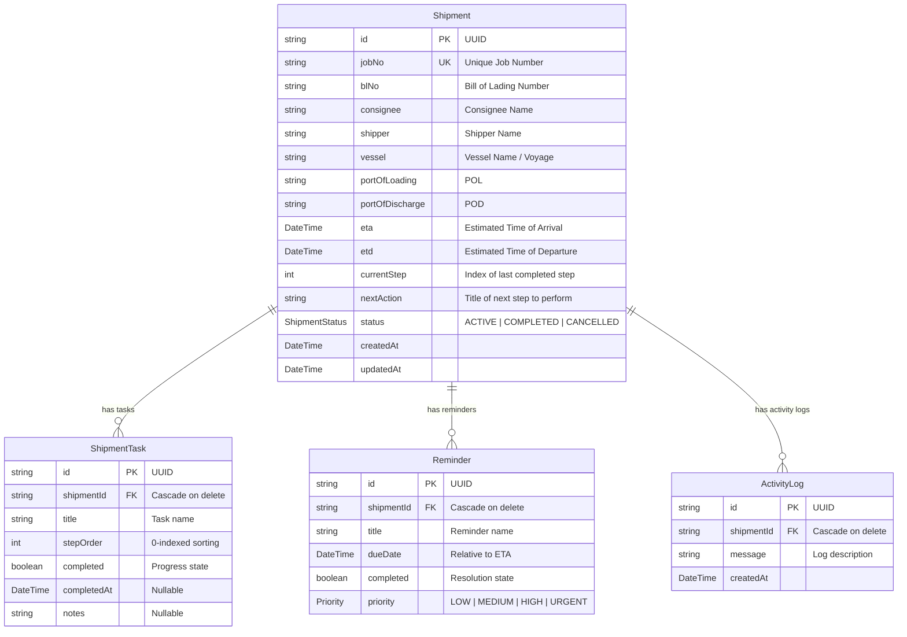

# CS Eksim Tracker - System Documentation

Welcome to the **CS Eksim Tracker (Import Export Customer Service Tracking Suite)**. This system is designed as an internal freight operations workflow tool to monitor shipments, track checklist tasks, and manage operations reminders/exceptions in real time.

---

## 1. Feature Architecture & Functional Details

### 1.1. Command Dashboard (`/`)
The primary operational cockpit for Customer Service personnel. It highlights current workloads and alerts users to critical time-sensitive events.

#### A. KPI Metrics Row
Four real-time metric cards that summarize current pipeline health:
*   **Total Active**: Displays the total count of active shipments (`status: ACTIVE`) currently in progress.
*   **Need Action Today**: Count of incomplete reminders where the due date is today.
*   **Overdue Reminders**: Count of incomplete reminders where the due date is prior to today. This indicates tasks that have missed their target operational window.
*   **ETA This Week**: Count of active shipments arriving between today and the end of the current week.

#### B. Exception & Action Board
An action-oriented board split into three columns:
*   **Overdue Action Queue**: Displays incomplete reminders whose target dates are in the past. Cards in this column are highlighted with urgency indicators to signal that operations are falling behind SLA.
*   **Today's Action Board**: Displays reminders due today, sorted by priority (`URGENT` > `HIGH` > `MEDIUM` > `LOW`).
*   **Upcoming Actions Pipeline**: Lists the next 15 upcoming incomplete reminders due after today, helping CS plan ahead.

#### C. Quick-Action Resolve on Reminder Cards
Each reminder card on the dashboard now contains an inline action row at the bottom with two controls:
*   **"Resolve" Button** (`ResolveReminderButton`): A one-click button that immediately marks the reminder as `completed = true` via a Server Action. While the action is in-flight, the button shows a spinner and is disabled to prevent double-submission. On success, both the dashboard (`/`) and the related shipment detail page (`/shipments/[id]`) are revalidated automatically.
*   **"View Detail" Link**: A secondary link that navigates CS directly to the full `/shipments/[id]` page for deeper inspection without leaving the dashboard.

---

### 1.2. Shipments File Ledger (`/shipments`)
A comprehensive, searchable repository of all historical and active shipments.
*   **Global Search**: Allows users to filter shipments instantly by **Job Number**, **B/L or AWB Number**, **Consignee Corporate Name**, or **Shipper Corporate Name**.
*   **Status Filter**: Filter by `ACTIVE`, `COMPLETED`, or `CANCELLED`.
*   **Sorting**: Sort shipments chronologically by **ETA** (Ascending or Descending).
*   **Pagination**: Handled on the server side to support thousands of shipments efficiently.

---

### 1.3. Pipeline Provisioning (`/shipments/create`)
The entrance point for new operational tasks. When CS initializes a new tracking pipeline, the system automates task creation:
*   **Inputs**: Job Number, Bill of Lading (B/L) / AWB, Shipper, Consignee, Vessel Reference, Port of Loading (POL), Port of Discharge (POD), ETD, and ETA.
*   **Validation**: Uses a Zod schema (`shipmentSchema`) to enforce constraints (e.g., minimum text lengths, valid date structures, and a constraint preventing **ETA** from being earlier than **ETD**).
*   **Task Auto-Generation**: Generates 18 sequential steps (defined in `WORKFLOW_STEPS`) in the `ShipmentTask` table.
*   **Reminder Auto-Generation**: Generates 5 default reminders calculated relative to the shipment's **ETA** (defined in `REMINDER_TEMPLATES`).

---

### 1.4. File Inspection / Shipment Details (`/shipments/[id]`)
An interactive checklist dashboard for checking progress and marking tasks completed.
*   **ShipmentInfoCard**: A read-only card showing core logistics, ports, and vessel dates.
*   **ProgressCard**: A visual tracker displaying percentage completion, current step number, and the immediate next action.
*   **WorkflowChecklist**: An interactive list of all 18 sequential tasks.
    *   CS can toggle tasks as complete.
    *   Toggling a task automatically records a timestamp (`completedAt`) and supports entering inline notes (e.g., billing references, customs numbers).
    *   Completing the final task ("Delivered") automatically archives the shipment, updating its status to `COMPLETED` and setting its next action to `"Archive Complete"`.

---

## 2. Database Models (`prisma/schema.prisma`)

The database uses PostgreSQL (configured via Prisma). It contains three main entities:



---

## 3. Project File Structure & Layering

The codebase is organized following clean architectural practices:

*   `app/`: Next.js routing, layouts, and page entrypoints.
*   `actions/`: Next.js Server Actions used to bridge client triggers and database mutations.
*   `components/`: Reusable global UI elements (sidebar, layout, etc.).
*   `features/`: Module-specific code grouped by business domains:
    *   `dashboard/`: Widgets, action queues, and metrics cards.
    *   `shipments/`: Shipment forms, lists, info blocks, and the interactive workflow checklist.
*   `repositories/`: Database query logic (encapsulating Prisma queries).
    *   `shipment-repository.ts`: Direct CRUD actions for shipments, tasks, and reminders.
*   `service/`: Business services coordinates workflows.
    *   `dashboard-service.ts`: Resolves metric counts and action board datasets.
    *   `shipment-service.ts`: Handles automated task calculation, relative reminder scheduling, and sequential step transitions.
*   `lib/`: Validator schemas, shared types, and static configuration/constants.

---

## 4. Extension & Future Customization Guide

### 4.1. Modifying the Checklist Workflow Steps
If your team wants to add, remove, or change operational steps (e.g., adding a step for "Container Returned" after "Delivered"):
1.  Open [lib/workflow.ts](file:///d:/Project/Nextjs/shipment-track/lib/workflow.ts).
2.  Update the array `WORKFLOW_STEPS`:
    ```typescript
    export const WORKFLOW_STEPS = [
      "Shipment Received",
      // ... existing steps
      "Delivered",
      "Empty Container Returned", // <--- Add your new step here
    ] as const;
    ```
3.  The system will automatically generate this new task in the correct order for all **new** shipments.

### 4.2. Customizing Automated Reminder Templates
To adjust default reminders (e.g., adding an alert for "Booking Trucking" 4 days before ETA):
1.  Open [lib/workflow.ts](file:///d:/Project/Nextjs/shipment-track/lib/workflow.ts).
2.  Add a new rule to the `REMINDER_TEMPLATES` array:
    ```typescript
    export const REMINDER_TEMPLATES = [
      { daysBeforeEta: 7, title: "Check Draft PIB", priority: "MEDIUM" as const },
      { daysBeforeEta: 4, title: "Pre-book Trucking Co.", priority: "HIGH" as const }, // <--- Added
      // ... other templates
    ];
    ```
3.  The `ShipmentService` automatically processes this array to schedule reminders relative to the ETA when creating a shipment.

### 4.3. Updating Database Schema
To add new fields (e.g., `containerNo` or `consigneeEmail`) to shipments:
1.  Open [prisma/schema.prisma](file:///d:/Project/Nextjs/shipment-track/prisma/schema.prisma) and add the field:
    ```prisma
    model Shipment {
      // ... existing fields
      containerNo String? // <--- Add new fields here
    }
    ```
2.  Run the migration command in terminal:
    ```bash
    pnpm prisma migrate dev --name add-container-no
    ```
3.  Update the validator schema in [lib/validator.ts](file:///d:/Project/Nextjs/shipment-track/lib/validator.ts) to handle input fields inside the creation form.

---

## 5. Changelog

### v1.1.0 — 2026-06-21: Quick-Action Resolve on Dashboard Reminder Cards

**Feature**: Added a "Resolve" quick-action button directly on each reminder card in the Exception & Action Board on the main dashboard.

#### Problem
Previously, CS staff had to navigate from the dashboard into the full shipment detail page (`/shipments/[id]`) just to mark a reminder as resolved. This added unnecessary navigation friction for a simple one-click operation.

#### Solution
Added an inline action row at the bottom of every `ReminderCard` on the dashboard containing:
1.  A **"Resolve" button** that calls the existing `toggleReminderAction` Server Action with a `completed: true` payload.
2.  A **"View Detail" link** for quick navigation to the shipment detail page when deeper context is needed.

#### Files Changed

| File | Change |
|------|--------|
| [`features/dashboard/ResolveReminderButton.tsx`](file:///d:/Project/Nextjs/shipment-track/features/dashboard/ResolveReminderButton.tsx) | **[NEW]** Client component with `useTransition` for pending state UX (spinner + disabled state while Server Action is in flight). |
| [`features/dashboard/ReminderCard.tsx`](file:///d:/Project/Nextjs/shipment-track/features/dashboard/ReminderCard.tsx) | **[MODIFIED]** Removed `"use server"` directive and old `<form>` toggle pattern. Restructured layout to include the new action row. Added `View Detail` link via `next/link`. |

#### Architecture Notes
*   `ResolveReminderButton` is a `"use client"` component intentionally separated from `ReminderCard` so that `ReminderCard` itself remains a lightweight server-renderable component (no `"use client"` directive needed on the card itself).
*   The `toggleReminderAction` Server Action already handles `revalidatePath("/")` and `revalidatePath("/shipments/[id]")`, so no additional cache invalidation was needed.
*   The `shipmentId` is passed through from `item.shipment.id` to allow per-shipment path revalidation.

### v1.2.0 — 2026-06-21: Multi-column Sort & Global Progress Loading Integration

**Feature**: Added secondary sorting configuration to the Shipment File Ledger, and implemented a global progress loading indicator for page navigations and Server Action transitions.

#### 1. Multi-column Sort (Status + ETA)
*   **Problem**: Shipments list was sorted only by ETA, resulting in active shipments being mixed with completed or cancelled ones.
*   **Solution**: Modified `ShipmentRepository.findAll` to implement multi-column sorting: sorting by `status` alphabetically first (`ACTIVE` → `CANCELLED` → `COMPLETED` matching our operational preference), followed by `eta` as a secondary sorting criterion.
*   **Shadcn Compliance**: Updated status badges color styling to use semantically compliant Shadcn class styles.

#### 2. Progress Loading Indicator (BProgress)
*   **Problem**: No visual feedback was shown when transitioning between routes or waiting for asynchronous database writes (Server Actions) to complete.
*   **Solution**: Integrated `@bprogress/next` (modern TypeScript replacement for NProgress).
    *   Configured the global provider in [`components/layout/Providers.tsx`](file:///d:/Project/Nextjs/shipment-track/components/layout/Providers.tsx) to use the Shadcn CSS token `var(--primary)` and a thin layout size (`3px`), ensuring color coordination with the active theme (including dark and light modes).
    *   Hooked manual controls (`useProgress` API) into components executing Server Actions (creating a shipment, toggling task checklist status, updating task notes, resolving dashboard reminders) using React's transition states.

#### Files Changed

| File | Change |
|------|--------|
| [`repositories/shipment-repository.ts`](file:///d:/Project/Nextjs/shipment-track/repositories/shipment-repository.ts) | **[MODIFIED]** Updated `findAll` sorting logic using multi-column `orderBy` array. |
| [`features/shipments/ShipmentTable.tsx`](file:///d:/Project/Nextjs/shipment-track/features/shipments/ShipmentTable.tsx) | **[MODIFIED]** Replaced custom tailwind/emerald badge styles with Shadcn compliant tokens. |
| [`components/layout/Providers.tsx`](file:///d:/Project/Nextjs/shipment-track/components/layout/Providers.tsx) | **[MODIFIED]** Refactored progress loading to target `var(--primary)` color token instead of static color. |
| [`features/dashboard/ResolveReminderButton.tsx`](file:///d:/Project/Nextjs/shipment-track/features/dashboard/ResolveReminderButton.tsx) | **[MODIFIED]** Injected `useProgress` manual triggers within transition handlers. |
| [`features/shipments/WorkFlowChecklist.tsx`](file:///d:/Project/Nextjs/shipment-track/features/shipments/WorkFlowChecklist.tsx) | **[MODIFIED]** Integrated progress hooks for task status toggles and note submission events. |
| [`features/shipments/ShipmentForm.tsx`](file:///d:/Project/Nextjs/shipment-track/features/shipments/ShipmentForm.tsx) | **[MODIFIED]** Hooked progress triggers during tracker pipeline provisioning. |

### v1.2.1 — 2026-06-21: Bidirectional Synchronization Between Reminders and Workflow Tasks

**Feature**: Connected reminders on the dashboard with tasks in the shipment workflow.

#### Problem
Previously, marking a reminder as "Resolved" on the dashboard only updated the `Reminder` record itself, leaving the corresponding operational shipment workflow task incomplete and the overall shipment progress percentage unchanged.

#### Solution
Implemented bidirectional mapping and automatic synchronization between reminders and workflow tasks:
1.  **Reminder to Task Sync**: Resolving a reminder (e.g. clicking "Resolve" on the dashboard) automatically resolves the matching workflow task and recalculates the shipment's current step, next action, and status (including logging to Activity Logs).
2.  **Task to Reminder Sync**: Toggling a task's status on the shipment checklist page automatically updates the completion status of the corresponding reminder, removing it from the dashboard's active exception queues.

#### Mapping Logic
*   `Check Draft PIB` (Reminder) ↔ `Draft PIB` (Task)
*   `Monitor BC 1.1` (Reminder) ↔ `BC 1.1 Available` (Task)
*   `Request Invoice DO` (Reminder) ↔ `Request Invoice DO` (Task)
*   `Payment Finance` (Reminder) ↔ `Payment Finance` (Task)
*   `Confirm Draft PIB` (Reminder) ↔ `Confirm Draft PIB` (Task)

#### Files Changed

| File | Change |
|------|--------|
| [`repositories/shipment-repository.ts`](file:///d:/Project/Nextjs/shipment-track/repositories/shipment-repository.ts) | **[MODIFIED]** Added `findReminderById`, `findReminderByTitle`, and `findTaskByTitle` query helpers. |
| [`service/shipment-service.ts`](file:///d:/Project/Nextjs/shipment-track/service/shipment-service.ts) | **[MODIFIED]** Added bidirectional synchronization logic inside `toggleTaskProgress` and implemented `toggleReminderProgress`. |
| [`actions/shipment-action.ts`](file:///d:/Project/Nextjs/shipment-track/actions/shipment-action.ts) | **[MODIFIED]** Updated `toggleReminderAction` server action to route through the service's sync method (`toggleReminderProgress`). |

### v1.3.0 — 2026-06-21: Debounced Client-Side Search for Shipment File Ledger

**Feature**: Implemented real-time debounced search on the shipments page, removing the need for manual form submission (pressing Enter).

#### Problem
CS staff had to type their search term and press Enter to trigger the search form, causing full page reloads and providing no visual progress indicators while results were loading.

#### Solution
Replaced the traditional HTML form search with a customized client-side **`ShipmentSearch`** component:
1.  **State Debounce**: Holds local state and triggers route replacement only after `400ms` of typing inactivity.
2.  **Interactive Transitions**: Uses React's `useTransition` hook combined with `@bprogress/next`'s custom router to trigger the top-page progress bar during query updates.
3.  **Inline Loader**: Shows an animated spinner inside the search input instead of the static search icon while the database query is in-flight.

#### Files Changed

| File | Change |
|------|--------|
| [`features/shipments/ShipmentSearch.tsx`](file:///d:/Project/Nextjs/shipment-track/features/shipments/ShipmentSearch.tsx) | **[NEW]** Debounced client-side input component using transitions and `@bprogress/next`'s custom router. |
| [`app/shipments/page.tsx`](file:///d:/Project/Nextjs/shipment-track/app/shipments/page.tsx) | **[MODIFIED]** Replaced the HTML `<form>` search input with the new `<ShipmentSearch>` component. |

### v1.4.0 — 2026-06-21: Dashboard UX Overhaul (Scrollable Reminders, Incomplete Tasks Table, ETA Pipeline)

**Feature**: Redesigned the main dashboard with a unified height structure for reminder boards, added an active pipeline tasks summary table, and created a visual ETA schedule pipeline.

#### 1. Fixed-Height Scrollable Reminder Columns
*   **Problem**: If there were many reminders, the reminder columns would grow indefinitely, breaking the dashboard layout.
*   **Solution**: Fixed the column card height to `h-[480px]` in [`features/dashboard/ReminderBoard.tsx`](file:///d:/Project/Nextjs/shipment-track/features/dashboard/ReminderBoard.tsx) and enabled internal overflow scrolling (`overflow-y-auto`), ensuring headers stay pinned at the top.

#### 2. Active Pipeline Tasks Summary Table
*   **Problem**: CS managers needed a central view of all incomplete operational tasks across active files without clicking into individual shipment detail pages.
*   **Solution**: Created [`features/dashboard/IncompleteTasksSummary.tsx`](file:///d:/Project/Nextjs/shipment-track/features/dashboard/IncompleteTasksSummary.tsx) to query and render active shipments.
*   **Mobile-First Design**: Implemented a responsive multi-layout view. On mobile screens (`md:hidden`), it displays a clean, readable card list where each card houses the job number, progress details, and next milestones. On desktop (`hidden md:table`), it switches to a full structured table layout to optimize larger screen spaces.

#### 3. Upcoming ETA Pipeline Schedule
*   **Problem**: Tracking incoming vessel dates was scattered across pages.
*   **Solution**: Created [`features/dashboard/UpcomingEtaPipeline.tsx`](file:///d:/Project/Nextjs/shipment-track/features/dashboard/UpcomingEtaPipeline.tsx) to render a visual schedule grid of active job numbers sorted chronologically by ETA. Proximity-colored countdown badges indicate if arrivals are today, tomorrow, upcoming, or overdue.
*   **Mobile-First Design**: Configured padding to be responsive (`p-4 sm:p-5`) and designed the grid layout to scale from a single column (`grid-cols-1`) on mobile, two columns on tablets, and three to four columns on desktop.

#### Files Changed

| File | Change |
|------|--------|
| [`features/dashboard/ReminderBoard.tsx`](file:///d:/Project/Nextjs/shipment-track/features/dashboard/ReminderBoard.tsx) | **[MODIFIED]** Configured fixed card height (`480px`), explicit mobile-first grid, and overflow scrolling inside the item list wrapper. |
| [`service/dashboard-service.ts`](file:///d:/Project/Nextjs/shipment-track/service/dashboard-service.ts) | **[MODIFIED]** Added `getActiveShipments` query method to fetch active files with their incomplete tasks. |
| [`features/dashboard/IncompleteTasksSummary.tsx`](file:///d:/Project/Nextjs/shipment-track/features/dashboard/IncompleteTasksSummary.tsx) | **[NEW]** Summary table component with progress bars, next milestone metrics, and a dedicated mobile card list view. |
| [`features/dashboard/UpcomingEtaPipeline.tsx`](file:///d:/Project/Nextjs/shipment-track/features/dashboard/UpcomingEtaPipeline.tsx) | **[NEW]** Chronological timeline grid display with proximity arrival status countdown tags and a mobile-first grid container. |
| [`app/page.tsx`](file:///d:/Project/Nextjs/shipment-track/app/page.tsx) | **[MODIFIED]** Parallel-fetched active shipments and integrated the new sections beneath the ReminderBoard. |
### v1.5.0 — 2026-06-21: Shipment Creation Form UX Redesign & Component Decomposition

**Feature**: Restructured the shipment creation form into a modern, mobile-first responsive split layout with a real-time visual shipment manifest preview sidebar, and decomposed it into strictly-typed subcomponents.

#### 1. Split-Screen Layout (Side Alignment)
*   **Problem**: The original shipment creation form was centered in a narrow container (`max-w-4xl mx-auto`), wasting horizontal layout space and offering no operational context to CS staff during data entry.
*   **Solution**: Redesigned the form to use a responsive, side-aligned split layout (`grid grid-cols-1 lg:grid-cols-12 gap-8 items-start w-full`). The input panels sit on the left (spanning 8 columns on large viewports), while a sticky visual shipment manifest preview card sits on the right (spanning 4 columns).

#### 2. Modular Component Decomposition & Strict Typing (Zero `any`)
*   **Problem**: The original form component (`ShipmentForm.tsx`) was very long and housed input elements, dates manipulation, validation styling, and state management in a single place. Additionally, the codebase contained type helpers that were loosely typed.
*   **Solution**: Decomposed the form into five single-responsibility subcomponents located under `features/shipments/components/`:
    1.  [`LogisticsSection.tsx`](file:///d:/Project/Nextjs/shipment-track/features/shipments/components/LogisticsSection.tsx): Job Reference & Bill of Lading inputs.
    2.  [`EntitiesSection.tsx`](file:///d:/Project/Nextjs/shipment-track/features/shipments/components/EntitiesSection.tsx): Shipper & Consignee inputs.
    3.  [`VesselRouteSection.tsx`](file:///d:/Project/Nextjs/shipment-track/features/shipments/components/VesselRouteSection.tsx): Voyage details and ports (POL/POD) inputs.
    4.  [`SchedulesSection.tsx`](file:///d:/Project/Nextjs/shipment-track/features/shipments/components/SchedulesSection.tsx): Calendar date inputs (ETD/ETA).
    5.  [`LivePreviewCard.tsx`](file:///d:/Project/Nextjs/shipment-track/features/shipments/components/LivePreviewCard.tsx): Graphical manifest card displaying route maps (POL 🚢 POD), dynamic transit days calculation, and auto-ingestion status trackers.
*   **Type Safety**: Strictly typed all props using React Hook Form interfaces (`UseFormRegister`, `FieldErrors`, and `UseFormSetValue`) and precise union types (e.g. `Date | string | null | undefined`), eliminating the use of the `any` type completely.

#### 3. Mobile-First Responsiveness
*   The parent grid structure stacks sections vertically on mobile viewports (`grid-cols-1`) and aligns them side-by-side on desktop environments (`lg:grid-cols-12`). Internal form inputs also stack vertically on small devices and split horizontally on tablet/desktop viewports (`grid grid-cols-1 md:grid-cols-2`).

#### Files Changed

| File | Change |
|------|--------|
| [`features/shipments/components/LogisticsSection.tsx`](file:///d:/Project/Nextjs/shipment-track/features/shipments/components/LogisticsSection.tsx) | **[NEW]** Modular inputs for Job No & BL No. |
| [`features/shipments/components/EntitiesSection.tsx`](file:///d:/Project/Nextjs/shipment-track/features/shipments/components/EntitiesSection.tsx) | **[NEW]** Modular inputs for Shipper & Consignee. |
| [`features/shipments/components/VesselRouteSection.tsx`](file:///d:/Project/Nextjs/shipment-track/features/shipments/components/VesselRouteSection.tsx) | **[NEW]** Modular inputs for Vessel & Routing. |
| [`features/shipments/components/SchedulesSection.tsx`](file:///d:/Project/Nextjs/shipment-track/features/shipments/components/SchedulesSection.tsx) | **[NEW]** Modular inputs for ETD/ETA. |
| [`features/shipments/components/LivePreviewCard.tsx`](file:///d:/Project/Nextjs/shipment-track/features/shipments/components/LivePreviewCard.tsx) | **[NEW]** Interactive preview sidebar with dynamic route progress and pipeline checkers. |
| [`features/shipments/ShipmentForm.tsx`](file:///d:/Project/Nextjs/shipment-track/features/shipments/ShipmentForm.tsx) | **[MODIFIED]** Refactored to coordinate states, imports, and submit callbacks. |

### v1.5.1 — 2026-06-21: Global Codebase Type Safety & Elimination of 'any'

**Feature**: Performed a global codebase review to replace all remaining loose `any` types in pages, components, repositories, and services with specific, type-safe structures.

#### 1. Dashboard Components & Type Index
*   **Reminder Card** ([ReminderCard.tsx](file:///d:/Project/Nextjs/shipment-track/features/dashboard/ReminderCard.tsx)): Replaced the loose `item: any` prop signature with `item: Reminder & { shipment: Shipment }` imported from the Prisma Client.
*   **Active Shipment Schedules & Tasks** ([UpcomingEtaPipeline.tsx](file:///d:/Project/Nextjs/shipment-track/features/dashboard/UpcomingEtaPipeline.tsx), [IncompleteTasksSummary.tsx](file:///d:/Project/Nextjs/shipment-track/features/dashboard/IncompleteTasksSummary.tsx)):
    *   Defined and exported a new `ShipmentWithTasks` type in [`lib/index.ts`](file:///d:/Project/Nextjs/shipment-track/lib/index.ts) representing `Shipment & { tasks: ShipmentTask[] }`.
    *   Replaced all occurrences of `shipments: any[]` with `shipments: ShipmentWithTasks[]`, matching the exact return values from `DashboardService.getActiveShipments()`.

#### Files Changed

| File | Change |
|------|--------|
| [`lib/index.ts`](file:///d:/Project/Nextjs/shipment-track/lib/index.ts) | **[MODIFIED]** Added and exported `ShipmentWithTasks` type definition. |
| [`features/dashboard/ReminderCard.tsx`](file:///d:/Project/Nextjs/shipment-track/features/dashboard/ReminderCard.tsx) | **[MODIFIED]** Typed the `item` prop using Prisma reminder and shipment relation models. |
| [`features/dashboard/UpcomingEtaPipeline.tsx`](file:///d:/Project/Nextjs/shipment-track/features/dashboard/UpcomingEtaPipeline.tsx) | **[MODIFIED]** Replaced `any[]` with `ShipmentWithTasks[]`. |
| [`features/dashboard/IncompleteTasksSummary.tsx`](file:///d:/Project/Nextjs/shipment-track/features/dashboard/IncompleteTasksSummary.tsx) | **[MODIFIED]** Replaced `any[]` with `ShipmentWithTasks[]`. |

### v1.6.0 — 2026-06-23: Shipping Line Live Tracker (ONE API Integration & Berthing Port Summary)

**Feature**: Built a shipping line tracking system that allows Customer Service agents to track shipping containers in real-time from Ocean Network Express (ONE) API, visualizes transit routes, resolves port terminals, and links directly from the shipments ledger.

#### 1. Live Carrier Integration & CORS Bypass
- **Server Action** ([track-action.ts](file:///d:/Project/Nextjs/shipment-track/actions/track-action.ts)): Implemented a server-side action to query the ONE live tracking API. This prevents browser CORS policy blocks by routing queries server-to-server.
- **Milestone Code Translation**: Built a dictionary map to resolve carrier codes (like `E061`, `E089`, `E105`) into clear customer-facing milestones ("Loaded on Vessel", "Cargo Discharged", "Import Gate Out").
- **Terminal Resolution**: Added logic to parse container current locations and map them to Tanjung Priok's main terminals (JICT, KOJA, NPCT1, TER3, TMAL).

#### 2. Visual Shipping manifests & Timelines
- **Live Tracker Page** ([page.tsx](file:///d:/Project/Nextjs/shipment-track/app/tracker/page.tsx)): Designed a URL-syncing tracking dashboard page (`/tracker`) with Suspense fallback loading skeletons and clean empty states.
- **Route Progress Stepper**: Implemented a responsive manifest visualizer that animates a ship icon moving along the transit lane depending on actual container progress (Origin Port 🚢 Mid Sea 🚢 Destination Port).
- **Milestone Steppers**: Formatted a progress bar utilizing Lucide-react specific indicators (`PackageOpen` ➡️ `ArrowRightLeft` ➡️ `Anchor` ➡️ `Ship` ➡️ `Truck` ➡️ `CheckCircle2`) to represent container state progress.
- **Detailed Timelines**: Created toggleable lists showing the detailed actual and planned log entries for each container.

#### 3. Navigation & Table Integration
- **Sidebar Integration** ([AppSidebar.tsx](file:///d:/Project/Nextjs/shipment-track/components/layout/AppSidebar.tsx)): Added the "Carrier Live Track" link to the primary system sidebar.
- **Shortcut Links** ([ShipmentTable.tsx](file:///d:/Project/Nextjs/shipment-track/features/shipments/ShipmentTable.tsx)): Embedded direct "Live Track 🚢" links in the shipments ledger rows. Clicking these automatically loads the corresponding live query on the tracker page.

#### Files Changed

| File | Change |
|------|--------|
| [`actions/track-action.ts`](file:///d:/Project/Nextjs/shipment-track/actions/track-action.ts) | **[NEW]** Live carrier tracking server-side logic and translation mappings. |
| [`app/tracker/page.tsx`](file:///d:/Project/Nextjs/shipment-track/app/tracker/page.tsx) | **[NEW]** Live tracker route controller, suspense boundary, and empty states. |
| [`features/tracker/TrackerForm.tsx`](file:///d:/Project/Nextjs/shipment-track/features/tracker/TrackerForm.tsx) | **[NEW]** Search form component utilizing Shadcn Select UI primitives and transition load states. |
| [`features/tracker/TrackerResults.tsx`](file:///d:/Project/Nextjs/shipment-track/features/tracker/TrackerResults.tsx) | **[NEW]** Stepper routes, milestone indicators, and detailed chronological timelines. |
| [`components/layout/AppSidebar.tsx`](file:///d:/Project/Nextjs/shipment-track/components/layout/AppSidebar.tsx) | **[MODIFIED]** Added search route shortcut in navigation. |
| [`features/shipments/ShipmentTable.tsx`](file:///d:/Project/Nextjs/shipment-track/features/shipments/ShipmentTable.tsx) | **[MODIFIED]** Injected quick tracking links inside rows. |
| [`.env`](file:///d:/Project/Nextjs/shipment-track/.env) | **[MODIFIED]** Fixed PostgreSQL loopback connections on Node 24. |

### v1.6.1 — 2026-06-23: Shadcn Select Layout Alignment & Server-Side Rendering (SSR) Optimization

**Feature**: Perfected the layout styling and server-side rendering support for the Shadcn Select components in the Live Tracker Search Form.

#### Improvements
1. **Height & Alignment Correction**: Added explicit `!h-10` height overrides to the `SelectTrigger` elements. This bypasses default Radix/Shadcn size attributes (which restrict triggers to `h-8` / `32px` tall), ensuring the dropdown triggers align perfectly with the `h-10` (`40px`) height of reference input text fields and tracking action buttons.
2. **Server-Side Hydration Pre-rendering**: Injected the dynamic text values (`Ocean Network Express (ONE)` / `Booking Number (BKG_NO)`) as children inside `<SelectValue>`. This forces Next.js to pre-render the active select option on the server response, eliminating blank select fields or visual layout shifts during client-side hydration.
3. **Grid Column Spacing & Symmetry Fix**: Replaced the mismatched block margins and spacing with a uniform flexbox-gap layout (`flex flex-col gap-1.5`) across all three grid columns, aligning the top and bottom bounds of all form controls perfectly.
4. **Input Field Style Match**: Styled the text input field with `bg-background border border-border` to replace the default transparent border and shaded background, matching the look, border thickness, and background color of the select triggers.

#### Files Changed

| File | Change |
|------|--------|
| [`features/tracker/TrackerForm.tsx`](file:///d:/Project/Nextjs/shipment-track/features/tracker/TrackerForm.tsx) | **[MODIFIED]** Optimized height overrides, unified gap structures, matching background/borders, and added server-side label pre-rendering logic to select controls. |

### v1.7.0 — 2026-06-23: Evergreen Marine (EMC) Live Tracking Integration

**Feature**: Added live tracking support for **Evergreen Marine (EMC)** containers using direct HTML servlet queries, rendering detailed container event timelines and route maps.

#### Improvements
1. **Direct Servlet POST Client**: Implemented a server-side client inside `actions/track-action.ts` to perform form POST queries directly to Evergreen's ShipmentLink portal servlet (`https://ct.shipmentlink.com/servlet/TDB1_CargoTracking.do`). This bypasses standard browser CORS restrictions and resolves queries by B/L, Booking, or Container numbers.
2. **HTML Metadata Parser**: Added a parser to extract B/L information (ETA, POL, POD, place of delivery, active vessel/voyage reference) and the container reference array from the returned HTML body.
3. **Dynamic Detailed Container Moves Lookup**: For every container resolved, the server action automatically issues a secondary POST query representing `TYPE=CntrMove` to retrieve the complete history of movement events (date, moves description, terminal location, active vessel/voyage details) for that specific container.
4. **Milestone Stepper Integration**: Added `"received"` as a keyword in the visual tracker results milestones, mapping Evergreen's `Received (FCL)` status correctly to the visual `Gate In` stepper.
5. **Form Integration**: Enabled **Evergreen Marine (EMC)** as an active, queryable carrier in the shipping line select dropdown in `TrackerForm.tsx`.

#### Files Changed

| File | Change |
|------|--------|
| [`actions/track-action.ts`](file:///d:/Project/Nextjs/shipment-track/actions/track-action.ts) | **[MODIFIED]** Implemented Evergreen server-side fetch, dynamic metadata parser, and detailed container moves query integration. |
| [`features/tracker/TrackerForm.tsx`](file:///d:/Project/Nextjs/shipment-track/features/tracker/TrackerForm.tsx) | **[MODIFIED]** Enabled Evergreen Marine (EMC) selection option in dropdown menus. |
| [`features/tracker/TrackerResults.tsx`](file:///d:/Project/Nextjs/shipment-track/features/tracker/TrackerResults.tsx) | **[MODIFIED]** Added "received" to the Gate In milestone keywords mapping. |

### v1.7.1 — 2026-06-23: Estimated ETA Display for In-Transit Shipments

**Feature**: Added live tracker visual indicators for estimated arrival dates when a shipment/container is still in transit (not yet arrived or discharged at destination).

#### Improvements
1. **POD Card ETA indicator**: Displays `Est. ETA: [Date]` with a yellow pulsing clock icon on the destination port card in the route visualization panel when the cargo is in transit. Displays `Arrived: [Date]` in green with a check icon when actually discharged.
2. **Stepper Milestone Fallback**: If a container has not reached the "Discharged" milestone, but a top-level cargo-manifest-level ETA exists from the carrier (e.g. Evergreen), the stepper displays `Est: [Date]` under the "Discharged" milestone label.
3. **Pulsing Indicator Dot**: Displays estimated milestones with an amber dashed border, light amber background, and a pulsing animation, helping users visually distinguish between actual completed events and future estimated arrivals.
4. **Clean Milestone Date Formatting**: Added a `formatMilestoneDate` helper inside `ContainerRow` to format dates containing time as `dd MMM HH:mm` and date-only strings (like top-level ETAs) as `dd MMM yyyy`.

#### Files Changed

| File | Change |
|------|--------|
| [`features/tracker/TrackerResults.tsx`](file:///d:/Project/Nextjs/shipment-track/features/tracker/TrackerResults.tsx) | **[MODIFIED]** Updated POD card template, milestone mappings, and milestone stepper to support in-transit estimated ETA rendering. |

### v1.7.2 — 2026-06-23: Evergreen Live Tracking Parser Optimization & Container Search Support

**Feature**: Fixed the ETA discrepancy where the live tracker fell back to the ETD/onboard date (June 18th) by introducing a highly resilient, single-regex ETA parser. Added full tracking support for container-only searches directly from the main page table.

#### Improvements
1. **Resilient Regex ETA Parser**: Replaced the two-stage regex logic with a single, highly flexible regex `Estimated Date of Arrival(?:\s+at\s+Destination)?\s*:\s*(?:<[^>]+>\s*)*([A-Z]{3}-\d{2}-\d{4}|\d{4}-\d{2}-\d{2})` that correctly extracts the carrier-provided ETA (June 24th, 2026) across all page formats, even if HTML tags or spacing vary.
2. **Container Search Moves Extraction**: Enabled parsing container tracking info and moves directly from the 8-column layout of the main page table for `CNTR_NO` queries (where pop-up detail servlet links are omitted by the carrier).
3. **Strict Type-Safety Verification**: Verified that the entire project compiles clean with zero typescript compile warnings/errors or ESLint rules violations, strictly avoiding any loose `any` types.

#### Files Changed

| File | Change |
|------|--------|
| [`actions/track-action.ts`](file:///d:/Project/Nextjs/shipment-track/actions/track-action.ts) | **[MODIFIED]** Enhanced ETA parsing regex and implemented container-only parsing support for CNTR_NO queries with explicit TypeScript typing. |

### v1.7.3 — 2026-06-23: HTML Character Entity Decoding Fix

**Feature**: Fixed the issue where voyage names (encoded in Chinese character entities like `&#x9577;`) and container type labels (encoded with hex space entities like `&#x20;`) appeared literally/broken in the user interface.

#### Improvements
1. **Unicode & Hex Entity Decoder**: Rewrote `decodeHtml` inside `actions/track-action.ts` to recursively decode hexadecimal references (`&#x...;`), decimal references (`&#...;`), and standard named entities (`&amp;`, `&lt;`, `&gt;`, `&quot;`, `&apos;`, `&nbsp;`) into standard Unicode character strings before returning them to the React frontend.
2. **Explicit Typings**: Explicitly typed all replacement variables in the decoder callbacks to preserve strict type-safety.

#### Files Changed

| File | Change |
|------|--------|
| [`actions/track-action.ts`](file:///d:/Project/Nextjs/shipment-track/actions/track-action.ts) | **[MODIFIED]** Implemented robust unicode and named entity decoding inside the `decodeHtml` helper. |

### v1.8.0 — 2026-07-16: Ad-hoc Todo List Feature

**Feature**: Added a "Todo List" feature on the shipment details page, allowing Customer Service agents to create, check off, and delete custom ad-hoc tasks specific to a shipment.

#### Improvements
1. **Database Schema**: Added a new `Todo` model mapped one-to-many with the `Shipment` model.
2. **Server Actions**: Created `actions/todo-action.ts` to handle creating, toggling, and deleting todos with automatic cache revalidation for a seamless user experience.
3. **UI Integration**: Created `TodoListCard.tsx` and embedded it directly beneath the Activity Logs on the shipment details page. The component utilizes `@bprogress/next` to provide loading feedback when executing server actions.

#### Files Changed

| File | Change |
|------|--------|
| [`prisma/schema.prisma`](file:///c:/Project/shipment-track/prisma/schema.prisma) | **[MODIFIED]** Added `Todo` model and established relation to `Shipment`. |
| [`lib/index.ts`](file:///c:/Project/shipment-track/lib/index.ts) | **[MODIFIED]** Updated `ShipmentWithRelations` to include the `todos` array. |
| [`repositories/shipment-repository.ts`](file:///c:/Project/shipment-track/repositories/shipment-repository.ts) | **[MODIFIED]** Updated `findById` to fetch `todos`. |
| [`actions/todo-action.ts`](file:///c:/Project/shipment-track/actions/todo-action.ts) | **[NEW]** Server actions `addTodoAction`, `toggleTodoAction`, and `deleteTodoAction`. |
| [`features/shipments/TodoListCard.tsx`](file:///c:/Project/shipment-track/features/shipments/TodoListCard.tsx) | **[NEW]** Client component for the ad-hoc todo list. |
| [`app/shipments/[id]/page.tsx`](file:///c:/Project/shipment-track/app/shipments/[id]/page.tsx) | **[MODIFIED]** Injected `TodoListCard` into the right column layout. |

